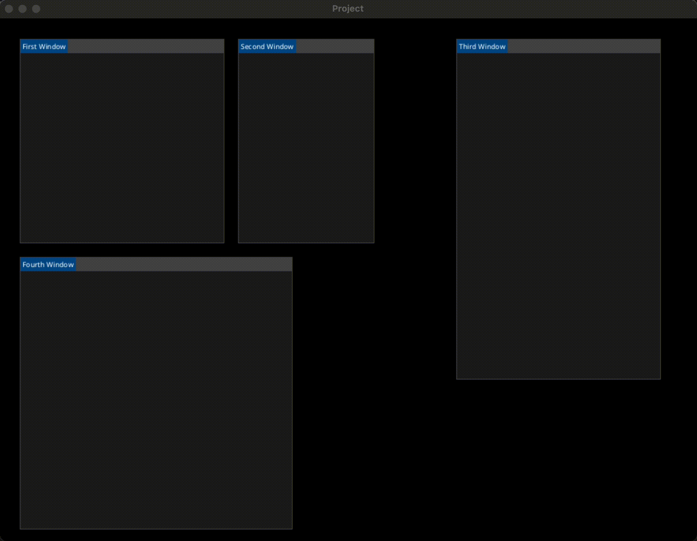
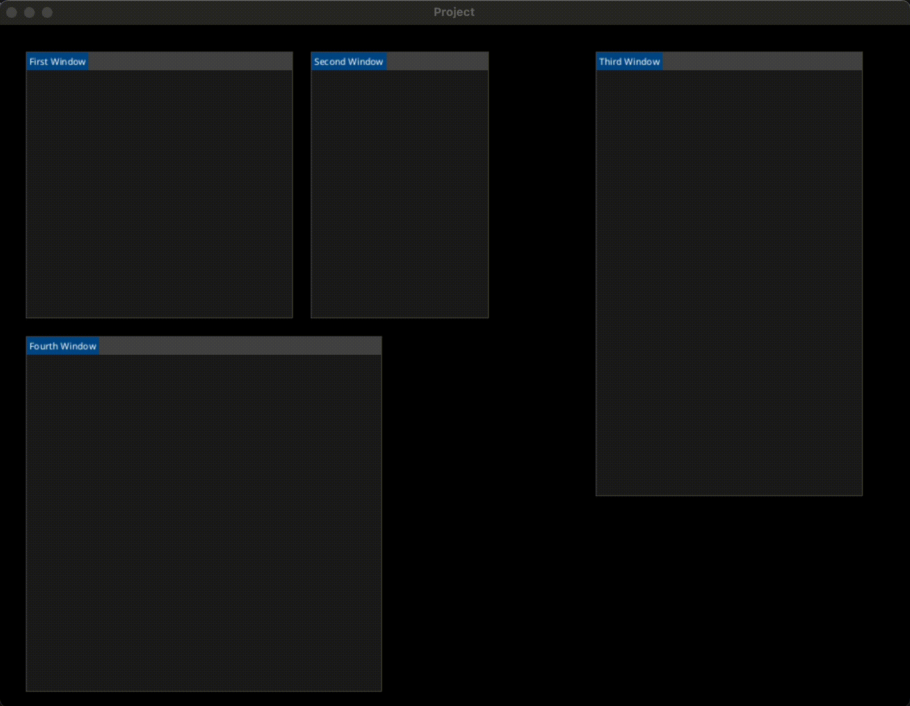

# Kimgui

## About
Kimgui (Kha Immediate Mode Graphical User Interface) is an immediate mode graphical user interface for Kha written in Haxe. Inspired by Zui from Armory, and Dear ImGui. The primary goals for Kimgui are:

- Minimal UI state storage - application state should have one source of truth.
- No callbacks - draw and accept user input inline.
- Layout system that supports window docking.
- Easy to theme.
- Easy to extend and add new elements.

## TODO

- [x] Ability to create Windows.
- [x] Ability to drag Nodes/Windows
- [x] Dragging Nodes over another Node reveals the hovered-nodes split placements
- [x] Dropping a dragged node onto a split-placement causes the root node to split
- [x] Resizing Nodes/Windows.
- [x] Sorting nodes/windows.
- [ ] Preventing event propagation.
- [ ] Window scrolling.
- [ ] Text/Labels.
- [ ] Buttons.
- [ ] Radio buttons.
- [ ] Check-boxes.
- [ ] Combo-boxes.
- [ ] Panels.
- [ ] Text inputs.
- [ ] Images.
- [ ] Ability to create rows.
- [ ] Ability to indent/unindent.