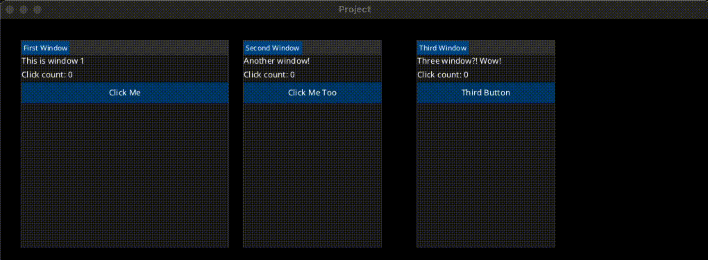
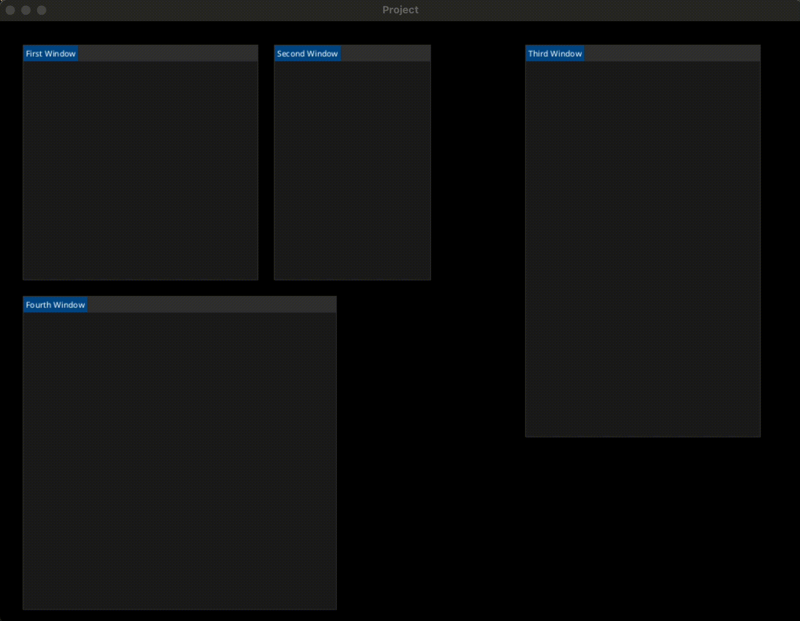

# Kimgui

## About
Kimgui (Kha Immediate Mode Graphical User Interface) is an immediate mode graphical user interface for Kha written in Haxe. Inspired by Zui from Armory, and Dear ImGui. The primary goals for Kimgui are:

- Minimal UI state storage - application state should have one source of truth.
- No callbacks - draw and accept user input inline.
- Layout system that supports window docking.
- Easy to theme.
- Easy to extend and add new elements.

## Examples

```haxe
class Application {
  var ui:Kimgui;
  var clicks: Array<Int>;

  public function new() {
    ui = new Kimgui({ font: Assets.fonts.OpenSansMedium });
    clicks = [0, 0, 0];
  }

  public function render(framebuffers: Array<Framebuffer>):Void {
    // As we are using only 1 window, grab the first framebuffer
    final fb = framebuffers[0];
    // Now get the `g2` graphics object so we can draw
    final g2 = fb.g2;

    ui.setScreenSize(fb.width, fb.height);

    // Start drawing, and clear the framebuffer to `petrol`
    g2.begin(true, Color.fromBytes(0, 0, 0));
      // Do normal rendering here
    g2.end();

    // Render UI after other rendering finishes
    ui.begin(g2);
      if (ui.window(Id.handle(), "First Window", 30, 30, 300, 300)) {
        ui.text("This is window 1");
        ui.text("Click count: " + clicks[0]);

        if (ui.button("Click Me")) {
          clicks[0]++;
        }
      }
      
      if (ui.window(Id.handle(), "Second Window", 350, 30, 200, 300)) {
        ui.text("Another window!");
        ui.text("Click count: " + clicks[1]);

        if (ui.button("Click Me Too")) {
          clicks[1]++;
        }
      }

      if (ui.window(Id.handle(), "Third Window", 600, 30, 200, 300)) {
        ui.text("Three window?! Wow!");
        ui.text("Click count: " + clicks[2]);
        if (ui.button("Third Button")) {
          clicks[2]++;
        }
      }
    ui.end();
  }
}
```


### Node Splitting


### Node Merging


## TODO

- [x] Ability to create Windows.
- [x] Ability to drag Nodes/Windows
- [x] Dragging Nodes over another Node reveals the hovered-nodes split placements
- [x] Dropping a dragged node onto a split-placement causes the root node to split
- [x] Resizing Nodes/Windows.
- [x] Sorting nodes/windows.
- [x] Detach nodes from their parent.
- [x] Preventing event propagation.
- [ ] Window scrolling.
- [x] Text/Labels.
- [x] Buttons.
- [ ] Radio buttons.
- [ ] Check-boxes.
- [ ] Combo-boxes.
- [ ] Panels.
- [ ] Text inputs.
- [ ] Images.
- [ ] Ability to create rows.
- [ ] Ability to indent/unindent.